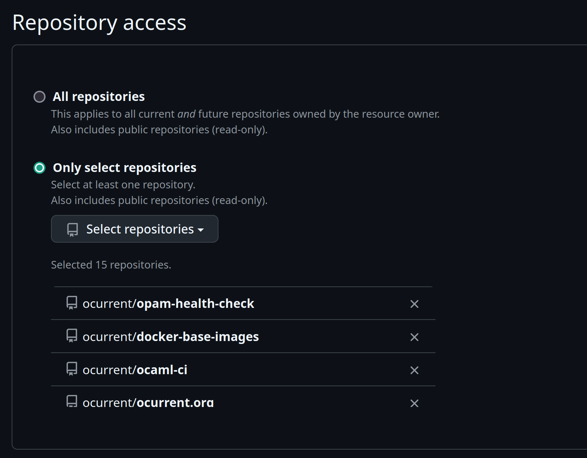

# Deployer

This repository contains an [OCurrent][] pipeline for deploying the
various other pipelines we use. When a new commit is pushed to the
`live` branch of a source repository, it builds a new Docker image
for the project and upgrades the service to that version.

The list of deployed services is located in [doc/services.md][].

The main configuration is in [pipeline.ml][]. For example, one entry is:

```ocaml
      ocurrent, "docker-base-images", [
        (* Docker base images @ images.ci.ocaml.org *)
        make_docker
          "Dockerfile"
          [
            make_deployment
              ~branch:"live"
              ~target:"ocurrent/base-images:live"
              [`Ocamlorg_images "base-images_builder"];
          ];
      ];
```

This says that for the <https://github.com/ocurrent/docker-base-images> repository:

- A deployment is registered monitoring the branch `live`.
- The deployment will use Docker to build the project's `Dockerfile` (and report
  the status on GitHub for each branch and PR).
- The deployments will publish the build image on Docker Hub as
  `ocurrent/base-images:live`.
- It will deploy the image as a service according to `Ocamlorg_images
  "base-images_builder"` (see [cluster.ml](src/cluster.ml)).

The pipeline also deploys some [MirageOS][] unikernels, e.g.

```ocaml
mirage, "mirage-www", [
  unikernel "Dockerfile" ~target:"hvt" ["EXTRA_FLAGS=--tls=true"] ["master", "www"];
  unikernel "Dockerfile" ~target:"xen" ["EXTRA_FLAGS=--tls=true"] [];     (* (no deployments) *)
];
```

This builds each branch and PR of <https://github.com/mirage/mirage-www> for both `hvt` and `xen` targets.
For the `master` branch, the `hvt` unikernel is deployed as the `www` [Albatross][] service.

See [VM-host.md](./VM-host.md) for instructions about setting up a host for unikernels.

There are 3 different deployer pipelines defined in this project, each deploying
a related set of services. Each is configured to deploy itself from its own
branch, serves a web UI from its own URL, and is registered with its own GitHub
Application. These relations are summarized in the following table:

| Deployer    | Branch           | URL                           | GitHub App                                    |
|-------------|------------------|-------------------------------|-----------------------------------------------|
| `Tarides`   | `live-ci3`       | <https://deploy.ci.dev>       | <https://github.com/apps/deploy-ci-dev>       |
| `Ocaml_org` | `live-ocaml-org` | <https://deploy.ci.ocaml.org> | <https://github.com/apps/deploy-ci-ocaml-org> |
| `Mirage`    | `live-mirage`    | <https://deploy.mirage.io>    | <https://github.com/apps/deploy-mirage-io>    |

The deployer's respective GitHub application is responsible for sending the
deployer notifications about updates to the repositories being monitored. If the
GitHub application is not updated to correspond to the repositories configured
for a deployer, it will receive no updates, and consequently nothing will be
deployed. See [Updating a deployer configuration](#updating-a-deployer-configuration).

## Testing locally

To test changes to the pipeline, use:

```
dune exec -- ocurrent-deployer-local --confirm=harmless --submission-service submission.cap \
                                     --github-webhook-secret-file github-secret-file \
                                     --flavour tarides -v \
                                     ocurrent/ocaml-ci
```

You will need a `submission.cap` to access an [OCluster build cluster](https://github.com/ocurrent/ocluster)
(you can run one locally fairly easily if needed), along with a `github-secret-file` containing a valid GitHub
secret for [securing webhooks](https://docs.github.com/en/developers/webhooks-and-events/webhooks/securing-your-webhooks).

Replace `ocurrent/ocaml-ci` with the GitHub repository you want to check, or omit it to check all of them.

Unlike the full pipeline, this:

- Only tries to build the deployment branches (not all PRs).
- Doesn't post the result to Slack.
- Uses anonymous access to get the branch heads.

You can supply `--github-app-id` and related options if you want to access GitHub via an app
(this gives a higher rate limit for queries, allows setting the result status and handling GitHub webhooks).

## Updating a deployer configuration

Each deployer is configured with a list of the repositories it monitors.
Whenever a repository is added to or removed from a deployer's configuration,
the respective GitHub App must also be updated. Once a configuration change has
been made and deployed (see [Updating services](#updating-services)), update the
GitHub App as follows:

- Navigate to
  <https://github.com/organizations/ocurrent/settings/installations>.
- Click "Configure" for the deployer's corresponding app.
- Under the "Repository access" panel, add or remove the relevant repository.

   

- The deployer runs deployability checks for repos it is monitoring and reports
  the results as CI statuses on PRs. We recommend configuring branch protections
  to make merges into development and production branches conditional on
  successful deployability checks. After a configuration change, ensure that the
  branch protection rules are up to date, and tracking the correct deployer.

## Suggested workflows

### Updating services

To update a deployment that is managed by ocurrent-deployer (which could be ocurrent-deployer itself):

1. Make a PR on that project's repository targeting its master branch as usual.
2. Once it has passed CI/review, a project admin will `git push origin
   HEAD:live` to deploy it (replacing `live` with the configured deployment
   branch, as needed).
3. If it works, the PR can be merged to master.

### Add a new service

1. Deploy the service(s) manually using `docker stack deploy` first.
2. Once that's working, make a PR against the ocurrent-deployer repository adding a rule to keep the services up-to-date.
   For the PR:
	- Drop the `id_rsa.pub` key in the `~/.ssh/authorized_keys` file on the machine where you want the deployer to deploy the container.
	- Add the machine where you want to have the deployments to the `context/meta` folder. eg to add `awesome.ocaml.org`
      ```
      docker --config config/docker context create \
        --docker host=ssh://awesome.ocaml.org \
        --description="awesome.ocaml.org" \
        awesome-ocaml-org
      ```
	- The hash for the folder inside `context/meta` is generated with `docker context create <machine_name>`.
	- Add to `known_hosts` with ssh-keyscan of the host where you are deploying the service. eg
      ```
      ssh-keyscan -H awesome.ocaml.org >> config/ssh/known_hosts
      ```

[OCurrent]: https://github.com/ocurrent/ocurrent
[MirageOS]: https://mirage.io/
[Albatross]: https://github.com/hannesm/albatross
[pipeline.ml]: ./src/pipeline.ml
[doc/services.md]: ./doc/services.md
